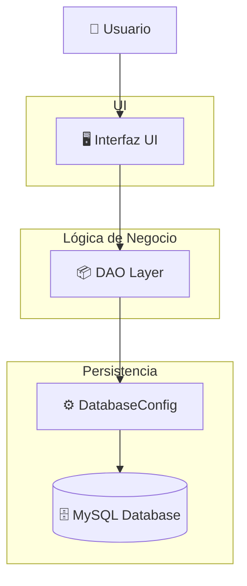
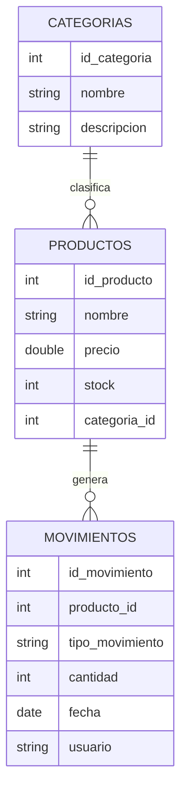
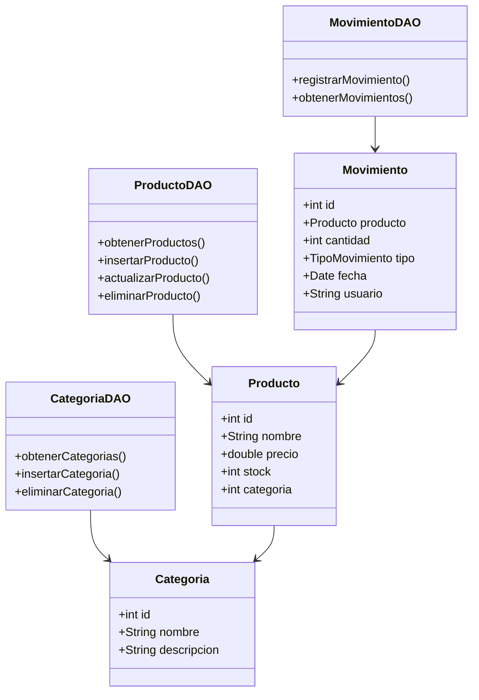
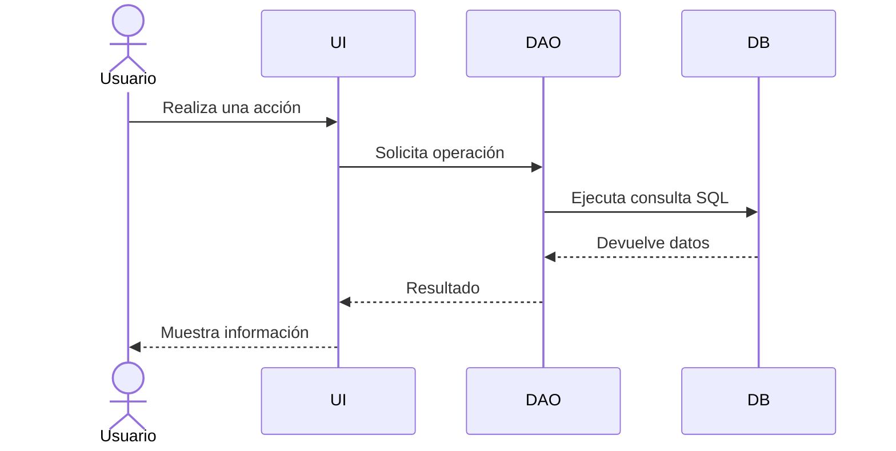

# 📊 Diagramas del Sistema

Para facilitar la comprensión del proyecto, a continuación se muestran algunos diagramas que explican la arquitectura, base de datos y funcionamiento del sistema.

---

# 🏗️ Arquitectura del Sistema

Este diagrama muestra cómo interactúan las diferentes capas del proyecto.

### Explicación

👤 **Usuario**
Interactúa con el sistema mediante la interfaz.

🖥️ **UI (Interfaz)**
Ventanas del sistema donde el usuario realiza acciones.

📦 **DAO**
Contiene la lógica que ejecuta consultas SQL.

⚙️ **DatabaseConfig**
Administra la conexión con la base de datos.

🗄️ **MySQL**
Almacena todos los datos del sistema.

---

# 🗄️ Diagrama de Base de Datos

Este diagrama representa la estructura principal de la base de datos del sistema.

### Explicación

📂 **Categorías**
Permiten organizar los productos.

📦 **Productos**
Contienen la información del inventario.

🔄 **Movimientos**
Registran entradas y salidas de productos.

Relaciones:

* Una **categoría** puede tener muchos productos.
* Un **producto** puede tener muchos movimientos.

---

# 🧩 Diagrama de Clases

Este diagrama muestra la estructura de las clases principales del sistema.

### Explicación

📦 **Producto**
Representa un artículo del inventario.

📂 **Categoria**
Clasifica los productos.

🔄 **Movimiento**
Registra entradas y salidas de inventario.

📦 **DAO**
Manejan la comunicación con la base de datos.

---

# 🔄 Flujo de Funcionamiento del Sistema

Este diagrama explica cómo se procesa una acción dentro del sistema.

### Ejemplo de flujo

1️⃣ El usuario registra un producto
2️⃣ La interfaz envía la solicitud al **ProductoDAO**
3️⃣ El DAO ejecuta un **INSERT en la base de datos**
4️⃣ MySQL guarda el producto
5️⃣ La interfaz muestra el resultado

---

# 🚀 Beneficios de esta Arquitectura

Este sistema utiliza buenas prácticas de desarrollo:

✔️ Separación de responsabilidades
✔️ Arquitectura por capas
✔️ Código modular
✔️ Fácil mantenimiento
✔️ Escalabilidad

---

# 📌 Autor

👨‍💻 **Kevin Rico Bermeo**
Desarrollador en formación

🔗 GitHub
https://github.com/KevinBermeo0318
